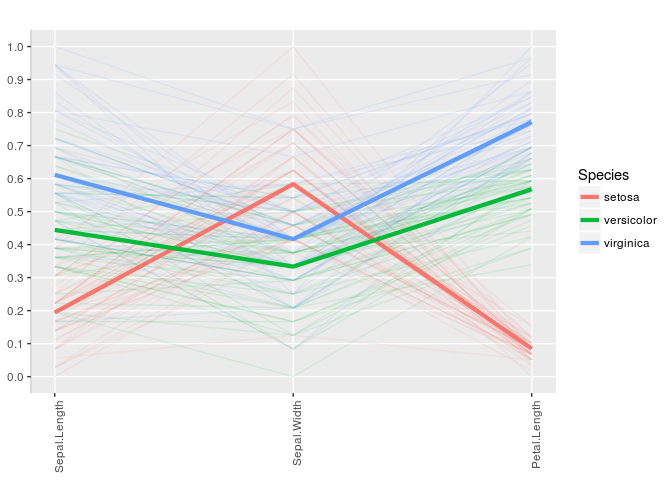

ggparci
=======

<!-- README.md is generated from README.Rmd. Please edit that file -->
Parallel Coordinates Plot with Groups medians and their Confidence Intervals

The main function `ggparci` plots parallel coordinates (gg)plot, in which each line connects the variables medians for each group.
Confidence "bands" for the medians are added to each line. This allows the assessment of groups (clusters) separations.
The variables can be normalized to \[0,1\] scale prior to plotting (see examples).
The plot aims to facilitates the comparison of several groups across several variables, with variability assessment via the confidence intervals.

**Note** : This fork is an adaptation of [talgalili/ggparci](https://github.com/talgalili/ggparci) for the Medical Information Platform (MIP). The apparent changes are in the input arguments formats, package dependencies and plotting style.

Installation
------------

To install the latest version run:

``` r
# install.packages("devtools")
devtools::install_github("HBPMedical/ggparci")
```

Example
-------

Some basic examples:

``` r
library(ggparci)
#> Loading required package: ggplot2
#> Loading required package: dplyr
#> 
#> Attaching package: 'dplyr'
#> The following objects are masked from 'package:stats':
#> 
#>     filter, lag
#> The following objects are masked from 'package:base':
#> 
#>     intersect, setdiff, setequal, union

ggparci(iris, groups_column = "Species", method = "none")
```


``` r
ggparci(iris, groups_column = "Species", method = "normalize")
```


``` r
ggparci(iris, groups_column = "Species", method = "percentize")
```


``` r

# select only some of the variables
# plot a line for each observation
# and dont plot the CIs
ggparci(iris,columns = 1:3, groups_column = "Species", include_obs_lines = T, alpha_ci_bands = 0)
```



``` r

# display each group in a different facet
ggparci(iris, groups_column = "Species", groups_in_facets = T)
#> Scale for 'x' is already present. Adding another scale for 'x', which
#> will replace the existing scale.
```


``` r

# flip the plot
ggparci(iris, groups_column = "Species", flip_coords = T)
```


